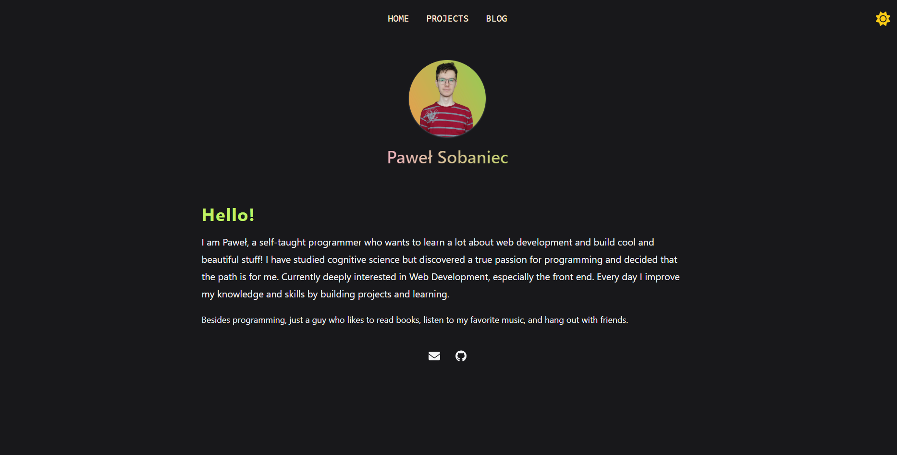

# Paweł's website
[https://psobaniec.vercel.app/](https://psobaniec.vercel.app/)

## Description
After grasping the basics of React and learning about NextJS, I decided that I would create a personal page where I would post my description so that people could get to know me, and also see my projects.

### Update
The updated version is here. I will still work on improving it but it's good enough to deploy it and replace the old portfolio. Also deploying makes it easier for me to spot a bugs. Enjoy.

## Walkthrough
This is the preview:

Main idea was to keep it simple. I did not used flashy things, because I feel like I did not need them.

Hovewer I did implement clickable dark/light mode, try it and choose which one do you prefer! I'm definitely the dark theme guy.

## Stack

- [Next.js](https://nextjs.org/) - A React framework that provides hybrid static & server rendering, TypeScript support etc.
- [TailwindCSS](https://tailwindcss.com/) - A utility-first CSS framework. Absolutely love it.
- [FramerMotion](https://www.framer.com/motion/) - A production-ready motion library for React to handle some of animations.

